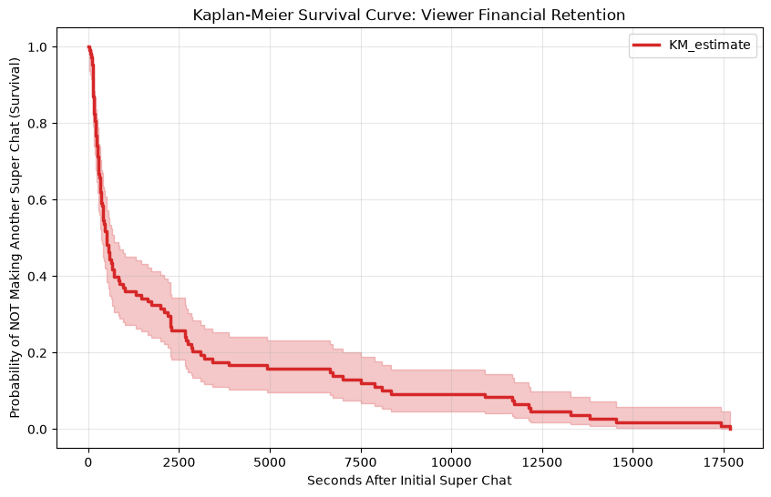

# Creator-Economy-Financial-Retention
Predicting viewer financial retention and livestream microtransaction velocity using Kaplan Meier survival analysis

# Creator Economy Financial Retention Engine

## The Business Problem
Predicting viewer financial retention and microtransaction velocity during high-volume live streams.

## Architecture & Tech Stack
*   **Data Acquisition:** Python (`pytchat`) script bypassing API throttles to extract high-volume JSON data from a 6-hour live broadcast.
*   **Database:** PostgreSQL ETL pipeline utilizing Window Functions (`LAG() OVER()`) to calculate exact inter-arrival times between financial transactions.
*   **Statistical Modeling:** Python (`Pandas`, `SciPy`, `Lifelines`) to map probability distributions and calculate wallet-retention half-life.

## Mathematical Insights
This project applies advanced probability and statistics to consumer behavior.

**1. The Impulse Window (Exponential Distribution)**
*   60% of all repeat transactions occur within a 16-minute impulse window immediately following the initial transaction.

**2. Wallet Retention Half-Life (Kaplan-Meier Survival Analysis)**
*   [INSERT YOUR MEDIAN SURVIVAL TIME HERE] seconds is the exact median survival time before a viewer initiates a second transaction.
*   

## Data Source
The raw JSON extraction is hosted as a public CC0 dataset on Kaggle. 
[Access the YouTube Livestream Microtransactions Dataset Here](https://www.kaggle.com/datasets/anantiku21/youtube-livestream-microtransactions-dataset)
